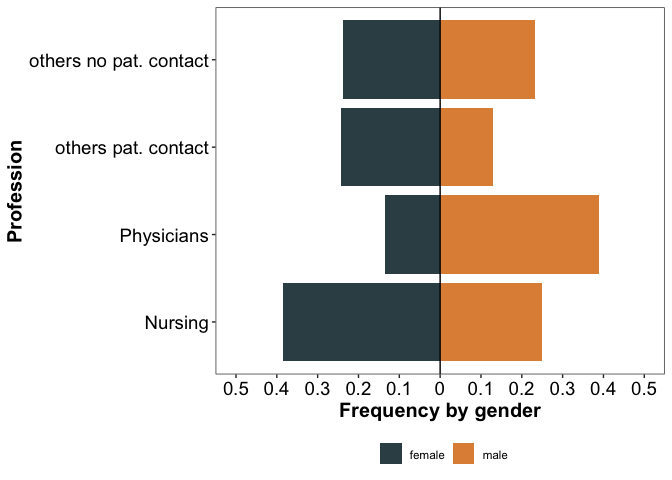

Statistical Analysis: Influencing factors of Anti-SARS-CoV-2-Spike-IgG
antibody titres in healthcare workers – A cross-section study

Julia Reusch<sup>1,2</sup>; Isabell Wagenhäuser<sup>1,2</sup>; Alexander Gabel<sup>1</sup>; Annika Eggestein<sup>1</sup>; Anna Wagner<sup>1</sup>; Thiên-Trí Lâm<sup>3</sup>; Anna Frey<sup>2</sup>; Alexandra Schubert-Unkmeir<sup>3</sup>; Lars Dölken<sup>4</sup>; Stefan Frantz<sup>2</sup>; Oliver Kurzai<sup>3,5</sup>; Ulrich Vogel<sup>1,3</sup>; Manuel Krone<sup>1,3\*</sup>; Nils Petri<sup>2\*</sup>
**Affiliations:**

<sup>1</sup> Infection Control Unit, University Hospital Wuerzburg, Wuerzburg, Germany
<sup>2</sup> Department of Internal Medicine I, University Hospital Wuerzburg, Wuerzburg, Germany
<sup>3</sup> Institute for Hygiene and Microbiology, University of Wuerzburg, Wuerzburg, Germany
<sup>4</sup> Institute for Virology and Immunobiology, University of Wuerzburg, Wuerzburg, Germany
<sup>5</sup> Leibniz Institute for Natural Product Research and Infection Biology – Hans-Knoell-Institute, Jena, Germany 
<sup>\*</sup> both authors contributed equally

Corresponding author: Nils Petri, Department of Internal Medicine I, University Hospital Wuerzburg, Oberdürrbacher Straße 6, 97080 Wuerzburg, Germany, +49-931-201-44987
Corresponding author email: petri_n@ukw.de


Reproducible Script
================

-   [External Packages and folder
    structure](#external-packages-and-folder-structure)
-   [Import data](#import-data)
-   [Distribution of IgG titres](#distribution-of-igg-titres)
-   [Population analysis - CovacSer vs respective German
    population](#population-analysis---covacser-vs-respective-german-population)
    -   [Age, Gender, Profession](#age-gender-profession)
    -   [Profession & Gender](#profession--gender)
    -   [Distribution of body mass index
        values](#distribution-of-body-mass-index-values)
-   [Correlation of factors](#correlation-of-factors)
-   [Vaccination concept specific: Days between event and sampling
    date](#vaccination-concept-specific-days-between-event-and-sampling-date)
    -   [Including outlier](#including-outlier)
    -   [Excluding outlier](#excluding-outlier)
-   [Vaccination concept specific: Days between event and sampling date
    vs. IgG](#vaccination-concept-specific-days-between-event-and-sampling-date-vs-igg)
    -   [Including outlier](#including-outlier-1)
    -   [Excluding outlier](#excluding-outlier-1)
-   [Remove outlier](#remove-outlier)
-   [Lasso-Regression for
    association](#lasso-regression-for-association)
    -   [1. Prepare data](#1-prepare-data)
    -   [2. Center and scale data](#2-center-and-scale-data)
    -   [3. 10-fold cross validatio to estimate
        lambda](#3-10-fold-cross-validatio-to-estimate-lambda)
    -   [4. MSE (Mean Squared Error) based on 10-fold cross validation
        (CV)](#4-mse-mean-squared-error-based-on-10-fold-cross-validation-cv)
    -   [5. Choose minimal lambda from
        CV](#5-choose-minimal-lambda-from-cv)
    -   [6. Finale model with minimal
        lambda](#6-finale-model-with-minimal-lambda)
    -   [7. Plot lasso regression for all sampled
        lambdas](#7-plot-lasso-regression-for-all-sampled-lambdas)
    -   [8. Variables (Factors) after lasso
        regularization](#8-variables-factors-after-lasso-regularization)
-   [Multiple regression model](#multiple-regression-model)
    -   [Check assumptions for multiple regression
        analysis](#check-assumptions-for-multiple-regression-analysis)
        -   [Test for Autocorrelation
            (Durbin-Watson)](#test-for-autocorrelation-durbin-watson)
        -   [Normality of residuals](#normality-of-residuals)
        -   [Variance of residuals](#variance-of-residuals)
    -   [Coefficients of the shrunken
        model](#coefficients-of-the-shrunken-model)
    -   [Posthoc tests: Pairwise comparisons within discrete
        factors](#posthoc-tests-pairwise-comparisons-within-discrete-factors)
    -   [Coefficients pairwise comparisons
        (All)](#coefficients-pairwise-comparisons-all)
    -   [Coefficients pairwise comparisons (stat. signif.
        differences)](#coefficients-pairwise-comparisons-stat-signif-differences)
    -   [Comparison IgG titres based on vaccination
        concept](#comparison-igg-titres-based-on-vaccination-concept)
    -   [Comparison influential
        factors](#comparison-influential-factors)
    -   [Comparison of associated
        factors](#comparison-of-associated-factors)

# External Packages and folder structure

``` r
options(scipen = 999)
library(dplyr)
library(ggplot2)
library(lubridate)
library(glmnet)
library(emmeans)

# required libraries:
# ggstance
# broom.mixed
# jtools
# effects
# sjPlot
# rstatix

super_dir <- "./"
plot.dir <- file.path(super_dir, "plots")
data.dir <- file.path(super_dir, "data")

population_data_dir <- "data/population_data"

if(!file.exists(data.dir)){
  dir.create(data.dir, recursive = T)
}

for(plt_format in c("png", "pdf", "svg")){

  if(!file.exists(file.path(plot.dir, plt_format))){
    dir.create(file.path(plot.dir, plt_format), recursive = T)
  }
}
```

# Import data

``` r
df_ana <- readRDS(file.path(data.dir, "covacser_data_igg.rds"))
```

# Distribution of IgG titres

``` r
plot_density <- function(){
  
  igg_df <- df_ana %>% select(IgG, logIgG) %>% tidyr::pivot_longer(cols = c(IgG, logIgG), names_to = "transform", values_to = "values")
  theo_params <- igg_df %>% group_by(transform) %>% summarise(mu_est = mean(values),
                                                             sd_est = sd(values),
                                                             xmin = min(values),
                                                             xmax = max(values))
  dens_plts <- list()
  igg_names <- unique(igg_df$transform)

  mains <- c("Density of IgG titres", "Density of logarithmized IgG titres")
  xlabs <- c("IgG", "log10(IgG)")

  m <- rbind(c(0, 0.5, 0, 1), 
             c(0.5, 1, 0, 1))

  split.screen(m)
  
  for(i in seq_along(igg_names)){
  
    screen(i)
  
    if(i == 1){
      par(mar = c(4.1, 4.1, 2.1, .5))
    }
    
    if(i == 2){
      par(mar = c(4.1, 4.1, 2.1, .5))
    }
  
    values <- df_ana %>% pull(!!sym(igg_names[i]))
    x_vals <- seq(min(values), max(values), length.out = 1000)

    hist(values, xlab = xlabs[i], prob = T, col = "white", main = mains[i], breaks = 30)
    lines(x = x_vals, y = dnorm(x = x_vals, mean = mean(values), sd = sd(values)), lty = 1, lwd = 2)
    box()
  }

  close.screen(all.screens = TRUE)

}

png(filename = file.path(plot.dir, paste0("png/Distribution_IgG_titres.png")),units="px", width=2500, height=1000, res=300)
plot_density()
close.screen(all.screens = TRUE)
dev.off()

plot_density()
```

<!-- -->

# Population analysis - CovacSer vs respective German population

## Age, Gender, Profession

A.) Gender and Age of health care workers and respectie german
population - Comparison of female and male population distributions with
Kolmogorov Smirnov Test B.) Age and Profession within health care
workers

``` r
ger_dat <- read.table(file.path(population_data_dir, "destatis_bevoelkerung_30122020_090322.csv.gz"),sep = ",", header = T)

ger_dat <- ger_dat %>% filter(Altersjahre != "Insgesamt") %>%
  mutate(Altersjahre = as.numeric(gsub(x = Altersjahre, pattern = "-Jaehrige", replacement = ""))) %>%
  filter(Altersjahre >= 18 & Altersjahre < 76) %>%
  mutate(AgeBreaks = cut(Altersjahre, breaks = c(-1,seq(24,60,5), 64, 100), labels = c("<25", paste0(seq(25,60,5), "-", seq(29,64,5)), ">65"))) %>%
  group_by(AgeBreaks) %>%
  summarise(male = sum(maennlich),
            female = sum(weiblich)) %>%
  tidyr::pivot_longer(cols = c("male", "female"), names_to = "gender", values_to = "germany")

df_age <- df_ana %>% select(id, Age, gender) %>%
  mutate(AgeBreaks = cut(Age, breaks = c(-1,seq(24,60,5), 64, 100), labels = c("<25", paste0(seq(25,60,5), "-", seq(29,64,5)), ">65"))) %>%
  group_by(AgeBreaks, gender) %>% count(name = "ukw") %>% dplyr::right_join(ger_dat) %>% ungroup() %>%
  mutate(across(.cols = where(is.numeric), .fns = function(x) replace(x, which(is.na(x)), 0)),
         germanyFreq = germany/sum(germany),
         ukwFreq = ukw/sum(ukw),
         germanyFreq = if_else(gender == "male", true = germanyFreq, false = -1 * germanyFreq),
         ukwFreq = if_else(gender == "male", true = ukwFreq, false = -1 * ukwFreq),
         AgeBreaks = factor(AgeBreaks, levels = c("<25", paste0(seq(25,60,5), "-", seq(29,64,5)), ">65")),
         gender = factor(gender, levels = c("female", "male"))) %>% arrange(AgeBreaks, gender)

ks_pvals <- df_age %>% group_by(gender) %>% summarise(pval= ks.test(x = abs(ukwFreq), y = abs(germanyFreq))$p.value) %>%
            mutate(pvalue = dplyr::case_when(pval < 1e-4 ~ "< 10^-4",
                                             pval > 1e-4 &  pval < 1e-3  ~"< 10^-3",
                                             pval > 1e-3 &  pval < 1e-2  ~ "< 0.01",
                                             pval > 1e-2 &  pval < 0.05  ~ "< 0.05",
                                             TRUE ~ "> 0.05"
                                             ))


age_pyramide_plt <- ggplot2::ggplot() +
  ggplot2::geom_bar(stat = "identity", data = df_age, ggplot2::aes(y = ukwFreq, x = AgeBreaks, fill = gender), col = "black") +
  ggplot2::geom_line(data = df_age, aes(y = germanyFreq, x = AgeBreaks, group = gender), lwd = 1, color = "black", lty = 2) +
  ggsci::scale_fill_igv() +
  ggsci::scale_color_ucscgb() +
  ggplot2::scale_y_continuous(breaks = seq(-0.15, 0.15, 0.05), labels = c(seq(0.15,0,-0.05), seq(0.05, 0.15, 0.05)), limits = c(-0.15, 0.15)) +
  ggplot2::xlab("Age") +
  ggplot2::ylab("Frequency") +
  ggplot2::theme_bw() +
  ggplot2::theme(axis.text = ggplot2::element_text(size = 16, colour = "black"),
                 axis.title = ggplot2::element_text(face = "bold", size = 17),
                 legend.title = ggplot2::element_blank(),
                 legend.text = ggplot2::element_text(size = 16),
                 legend.position = "bottom", 
                 panel.grid = ggplot2::element_blank()) +
  ggplot2::coord_flip() +
  ggplot2::annotate(geom = "text", label = paste0("italic(p) ", ks_pvals$pvalue), x = 10.25, y = c(-0.1,0.1), cex = 5, parse = TRUE)


pop_dat <- readr::read_delim(file.path(population_data_dir,"22412-0007_alte_pflege.csv.gz"),delim = ";")
pop_dat <- cbind(AgeBreaks = c("<20", "20-29", "30-39", "40-49", "50-59", "60-64", ">65"), pop_dat)
pop_dat <- pop_dat[,c(1,4)]
colnames(pop_dat)[2] <- "hcw"

df_age <- df_ana %>% select(id, Age) %>% mutate(AgeBreaks = cut(Age, breaks = c(0,seq(19,60,10), 64, 100), labels = c("<20", "20-29", "30-39", "40-49", "50-59", "60-64", ">65"))) %>%
  group_by(AgeBreaks) %>% count(name = "ukw") %>% inner_join(pop_dat) %>% ungroup() %>% mutate(ukw = -ukw/sum(ukw), hcw = hcw/sum(hcw))


df_age <- df_age %>% tidyr::pivot_longer(cols = c(ukw,hcw), names_to = "location", values_to = "number")

df_age$location <- factor(df_age$location, levels = c("ukw", "hcw"))
df_age$AgeBreaks <- factor(df_age$AgeBreaks, levels = c("<20", "20-29", "30-39", "40-49", "50-59", "60-64", ">65"))

hcw_pyramide <- ggplot2::ggplot(df_age, ggplot2::aes(x = number, y = AgeBreaks, fill = location)) +
  ggplot2::geom_bar(stat = "identity", col = "black") +
  ggsci::scale_fill_jama(labels = c("CoVacSer", "HCW in Germany"))+
  ggplot2::scale_x_continuous(breaks = seq(-0.5, 0.5, 0.1), labels = c(seq(0.5,0,-0.1), seq(0.1, 0.5, 0.1))) +
  ggplot2::xlab("Frequency") +
  ggplot2::ylab("Age") +
  ggplot2::theme_bw() +
  ggplot2::theme(axis.text = ggplot2::element_text(size = 16, colour = "black"),
                 axis.title = ggplot2::element_text(face = "bold", size = 17),
                 legend.title = ggplot2::element_blank(),
                 legend.text = ggplot2::element_text(size = 16),
                 legend.position = "bottom", 
                 panel.grid = ggplot2::element_blank())


comb_pop_plt <- cowplot::plot_grid(age_pyramide_plt, hcw_pyramide + ggplot2::theme(axis.title.y = ggplot2::element_blank()), rel_widths = c(0.5,0.45), labels = LETTERS[1:2], label_size = 18)

ggplot2::ggsave(plot = comb_pop_plt, filename = file.path(plot.dir, "png", "combined_pyramide_plots.png"), device = "png",  width = 10, height = 5, dpi = 300)

comb_pop_plt
```

<!-- -->

## Profession & Gender

``` r
df_ana %>% group_by(gender, profession) %>% count()  %>% group_by(gender) %>%
                                                   mutate(freq = n/sum(n)) %>%
  mutate(n = if_else(gender == "female", true = -1 * n, false = 1 * n),
         freq = if_else(gender == "female", true = -1 * freq, false = 1 * freq)) %>%
  ggplot2::ggplot(ggplot2::aes(y = as.factor(profession), x = freq, fill = as.factor(gender))) +
  ggplot2::geom_bar(stat = "identity")+
  ggplot2::xlab("Frequency by gender") +
  ggplot2::ylab("Profession") +
  ggplot2::theme_bw() +
  ggsci::scale_fill_jama() +
  ggplot2::scale_y_discrete(labels = c("Nursing", "Physicians", "others pat. contact", "others no pat. contact")) +
  ggplot2::scale_x_continuous(breaks = seq(-0.5, 0.5, 0.1), labels = c(seq(0.5,0,-0.1), seq(0.1, 0.5, 0.1)), limits = c(-0.5, 0.5)) +
  ggplot2::theme(axis.text = ggplot2::element_text(size = 14, colour = "black"),
                 axis.text.x = ggplot2::element_text(colour = "black"),
                 axis.title = ggplot2::element_text(face = "bold", size = 15),
                 strip.text = ggplot2::element_text(face = "bold", size = 14),
                 legend.title = ggplot2::element_blank(),
                 legend.position = "bottom",
                 panel.grid = ggplot2::element_blank()) +
  ggplot2::geom_vline(xintercept = 0)
```

<!-- -->

``` r
ggplot2::ggsave(plot = last_plot(), filename = file.path(plot.dir, "png", "Histogram_profession.png"), device = "png",  width = 7, height = 5, dpi = 300)
```

## Distribution of body mass index values

``` r
df_ana %>% ggplot2::ggplot(ggplot2::aes(x = bmi, fill = factor(gender))) +
  ggplot2::geom_density(alpha = 0.5) +
  ggplot2::xlab("BMI of subjects") +
  ggplot2::ylab("Density") +
  ggplot2::theme_bw() +
  ggplot2::theme(axis.text = ggplot2::element_text(size = 14, colour = "black"),
                 axis.title = ggplot2::element_text(face = "bold", size = 15),
                 strip.text = ggplot2::element_text(face = "bold", size = 14),
                 legend.title = ggplot2::element_blank(),
                 legend.text = ggplot2::element_text(size = 14, colour = "black"),
                 legend.position = "bottom") +
  ggsci::scale_fill_d3()
```

<!-- -->

``` r
ggplot2::ggsave(plot = last_plot(), filename = file.path(plot.dir, "png", "Histogram_BMI_distribution.png"), device = "png",  width = 6, height = 5, dpi = 300)
```

# Correlation of factors

``` r
cor_mat <- round(cor(df_ana %>% select(-id, -IgG, -Age) %>% mutate(across(where(is.factor), .fns = as.integer)) %>% as.matrix(), method = "spearman"), 2)

cor_mat_names <- c("Age", "Gender", "BMI", "Profession", "Contact to patients", "Contact to COVID patients", "Risk patient", "Immune system", "Smoking", "Life quality", 
               "Sastisfied with health condition", "Need of med. treatment", "Enjoyment", "Living a meaningful life", "Safety", "Longterm medication", "Vaccination concept", "Days since last event", "log10(IgG)")

pheatmap::pheatmap(cor_mat, cluster_rows = F, cluster_cols = F, fontsize_number = 10, display_numbers = T, fontsize_col = 10, fontsize_row = 10, labels_row = cor_mat_names, labels_col = cor_mat_names,
                     filename = file.path(plot.dir, "png", "Heatmap_correlations_all_factors.png"),  width = 12, height = 12, dpi = 300)
```

<!-- -->

# Vaccination concept specific: Days between event and sampling date

## Including outlier

``` r
df_ana %>%
  ggplot2::ggplot(ggplot2::aes(x = vacc, y = time_serum_last_event)) +
  ggplot2::stat_boxplot(geom = "errorbar", lwd = 1, width = 0.5, show.legend = FALSE) +
  ggplot2::geom_boxplot(aes(fill = vacc), color = "black", lwd = 1, show.legend = FALSE, outlier.size = 0) +
  ggbeeswarm::geom_quasirandom(alpha = 0.8, width = 0.4, pch = 20, size = 0.5) +
  ggplot2::theme_bw() +
  ggplot2::scale_x_discrete(labels = c("1 \n vaccination \n dose", "2 \n vaccination \n doses", "≥3 \n vaccination \n doses",  
                                       "Recovered \n with ≥1 \n vaccination \n dose", "Recovered \n without \n vaccination")) +
  ggsci::scale_fill_lancet() +
  ggplot2::theme(axis.text = ggplot2::element_text(size = 17, colour = "black"),
                 axis.title = ggplot2::element_text(face = "bold", size = 15),
                 legend.title = ggplot2::element_blank(),
                 legend.text = ggplot2::element_text(size = 15),
                 legend.position = "none") +
  ggplot2::ylab("Days since last event") +
  ggplot2::xlab("") +
  ggplot2::geom_hline(yintercept = 13, lty = 2)
```

<!-- -->

``` r
ggplot2::ggsave(plot = last_plot(), filename = file.path(plot.dir, "png", "boxplot_vacc_vs_days_with_outlier.png"), device = "png", , dpi = 300)
```

## Excluding outlier

**take only subjects with time since last event \< 350 days**

``` r
df_ana %>%
  filter(time_serum_last_event < 350) %>%
  ggplot2::ggplot(ggplot2::aes(x = vacc, y = time_serum_last_event)) +
  ggplot2::stat_boxplot(geom = "errorbar", lwd = 1, width = 0.5, show.legend = FALSE) +
  ggplot2::geom_boxplot(aes(fill = vacc), color = "black", lwd = 1, show.legend = FALSE, outlier.size = 0) +
  ggbeeswarm::geom_quasirandom(alpha = 0.8, width = 0.4, pch = 20, size = 0.5) +
  ggplot2::theme_bw() +
  ggplot2::scale_x_discrete(labels = c("1 \n vaccination \n dose", "2 \n vaccination \n doses", "≥3 \n vaccination \n doses",  
                                       "Recovered \n with ≥1 \n vaccination \n dose", "Recovered \n without \n vaccination")) +
  ggsci::scale_fill_lancet() +
  ggplot2::theme(axis.text = ggplot2::element_text(size = 17, colour = "black"),
                 axis.title = ggplot2::element_text(face = "bold", size = 15),
                 legend.title = ggplot2::element_blank(),
                 legend.text = ggplot2::element_text(size = 15),
                 legend.position = "none") +
  ggplot2::ylab("Days since last event") +
  ggplot2::xlab("") +
  ggplot2::geom_hline(yintercept = 13, lty = 2)
```

<!-- -->

``` r
ggplot2::ggsave(plot = last_plot(), filename = file.path(plot.dir, "png", "boxplot_vacc_vs_days_without_outlier.png"), device = "png",  width = 8, height = 6, dpi = 300)
```

# Vaccination concept specific: Days between event and sampling date vs. IgG

## Including outlier

``` r
df_ana %>%
  ggplot2::ggplot(ggplot2::aes(x = time_serum_last_event, y = IgG, col = vacc)) +
  ggplot2::geom_point(size = 1, alpha = 0.75) +
  ggplot2::scale_y_log10(limits = c(1, 30000)) +
  ggplot2::geom_smooth(method = "lm") +
  ggsci::scale_color_lancet(labels = c("1 \n vaccination \n dose", "2 \n vaccination \n doses", "≥3 \n vaccination \n doses",  "Recovered \n with ≥1 \n vaccination \n dose", "Recovered \n without \n vaccination")) +
  ggplot2::scale_x_continuous(breaks = seq(50,350,50), labels = seq(50,350,50)) +
  ggplot2::theme_bw() +
  ggplot2::theme(axis.text = ggplot2::element_text(size = 16, colour = "black"),
                 axis.title = ggplot2::element_text(face = "bold", size = 15),
                 legend.title = ggplot2::element_blank(),
                 legend.text = ggplot2::element_text(size = 13),
                 legend.position = "bottom") +
  ggplot2::ylab("SARS-CoV-2-Anti-Spike IgG [BAU/ml]") +
  ggplot2::annotation_logticks(sides = "l") +
  ggplot2::xlab("Days between last event and date of blood sample") +
  ggplot2::geom_hline(yintercept = 31.5, lty = 2) +
  ggplot2::guides(col = ggplot2::guide_legend(nrow = 1))
```

<!-- -->

``` r
ggplot2::ggsave(plot = last_plot(), filename = file.path(plot.dir, "png", "IgG_vacc_vs_days_with_outlier.png"), device = "png",  width = 8, height = 6, dpi = 300)
```

## Excluding outlier

``` r
df_ana %>%
  filter(time_serum_last_event < 350) %>%
  ggplot2::ggplot(ggplot2::aes(x = time_serum_last_event, y = IgG, col = vacc)) +
  ggplot2::geom_point(size = 1, alpha = 0.75) +
  ggplot2::scale_y_log10(limits = c(1, 30000)) +
  ggplot2::geom_smooth(method = "lm") +
  ggsci::scale_color_lancet(labels = c("1 \n vaccination \n dose", "2 \n vaccination \n doses", "≥3 \n vaccination \n doses",  "Recovered \n with ≥1 \n vaccination \n dose", "Recovered \n without \n vaccination")) +
  ggplot2::scale_x_continuous(breaks = seq(50,350,50), labels = seq(50,350,50)) +
  ggplot2::theme_bw() +
  ggplot2::theme(axis.text = ggplot2::element_text(size = 16, colour = "black"),
                 axis.title = ggplot2::element_text(face = "bold", size = 15),
                 legend.title = ggplot2::element_blank(),
                 legend.text = ggplot2::element_text(size = 13),
                 legend.position = "bottom") +
  ggplot2::ylab("SARS-CoV-2-Anti-Spike IgG [BAU/ml]") +
  ggplot2::annotation_logticks(sides = "l") +
  ggplot2::xlab("Days between last event and date of blood sample") +
  ggplot2::geom_hline(yintercept = 31.5, lty = 2) +
  ggplot2::guides(col = ggplot2::guide_legend(nrow = 1,
                                              override.aes = list(shape = 22, size = 6, stroke = 1, fill = NA)))
```

<!-- -->

``` r
ggplot2::ggsave(plot = last_plot(), filename = file.path(plot.dir, "png", "IgG_vacc_vs_days_without_outlier.png"), device = "png",  width = 8, height = 6, dpi = 300)
```

# Remove outlier

``` r
df_ana <- df_ana %>% dplyr::filter(time_serum_last_event < 350)
```

# Lasso-Regression for association

## 1. Prepare data

-   y… logarithmized IgG titres
-   X… matrix containing variables (factors)

``` r
y <- df_ana %>% pull(logIgG)
X <- df_ana %>% select(-id, -logIgG, -IgG, -Age)
```

-   convert categorical values into numbers
-   convert data.frame to matrix

``` r
X_lasso <- X %>% mutate(across(where(is.factor), .fns = as.integer)) %>% as.matrix()
```

## 2. Center and scale data

``` r
set.seed(10)
y_lasso <- y %>% scale(center = TRUE, scale = TRUE)

preProFeats <- caret::preProcess(X_lasso, method = c("center", "scale"))
X_lasso <- predict(preProFeats, X_lasso)
```

## 3. 10-fold cross validatio to estimate lambda

``` r
set.seed(10)
lambdas2try <- exp(seq(-6, 2, length.out = 120))
lasso_cv <- glmnet::cv.glmnet(X_lasso, y_lasso, alpha = 1, lambda = lambdas2try, intercept = FALSE, standardize = TRUE, nfolds = 10)
```

## 4. MSE (Mean Squared Error) based on 10-fold cross validation (CV)

``` r
plot(lasso_cv)
```

<!-- -->

``` r
png(filename = file.path(plot.dir, paste0("png/Lasso_cross_validation_IgG.png")), units="px", width=1600, height=1600, res=300)
plot(lasso_cv)
dev.off()
```

## 5. Choose minimal lambda from CV

``` r
lambda_cv <- lasso_cv$lambda.min

lasso_best <- broom::tidy(lasso_cv)[lasso_cv$index,] %>% rename(MSE = estimate)
lasso_best %>% knitr::kable(digits = 3)
```

| lambda |   MSE | std.error | conf.low | conf.high | nzero |
|-------:|------:|----------:|---------:|----------:|------:|
|  0.011 | 0.621 |     0.042 |    0.579 |     0.663 |    12 |
|  0.107 | 0.660 |     0.042 |    0.618 |     0.702 |     4 |

**
= 0.010878**

## 6. Finale model with minimal lambda

-   final selection of variables (factors)
-   calculate R^2 and sum of quadratic errors (SQE)

``` r
model_cv <- glmnet::glmnet(X_lasso, y_lasso, alpha = 1, lambda = lambda_cv, standardize = TRUE)

y_hat_cv <- predict(object = model_cv, newx = X_lasso)
rsquare_cv <- cor(y, y_hat_cv)^2
sqe_cv <- t(y - y_hat_cv) %*% (y - y_hat_cv)
```

**R^2 = 0.3911289** **SQE = 8931.6149393**

## 7. Plot lasso regression for all sampled lambdas

-   with increasing lambda more variables are set to zero
-   influence of increasing lambda on each variable (factor)

``` r
model_all_lambdas <- glmnet::glmnet(X_lasso, y_lasso, alpha = 1, lambda = lambdas2try, standardize = TRUE)

matplot(log(model_all_lambdas$lambda), t(as.matrix(model_all_lambdas$beta)), type = "l", lty = rep(c(1,2), each = 9), col = RColorBrewer::brewer.pal(9,"Set1"), lwd = 2,
        xlab = parse(text = ("Log(lambda)")), ylab = "Value of coefficients")
legend("topright", lty = rep(c(1,2), each = 9), col = rep(RColorBrewer::brewer.pal(9,"Set1"), 2) , lwd = 1.5, legend = colnames(X_lasso), cex = .7)
```

<!-- -->

``` r
png(filename = file.path(plot.dir, paste0("png/Lasso_cross_validation_selection_lambda_IgG.png")),units="px", width=2200, height=2000, res=300)
matplot(log(model_all_lambdas$lambda), t(as.matrix(model_all_lambdas$beta)), type = "l", lty = rep(c(1,2), each = 9), col = RColorBrewer::brewer.pal(9,"Set1"), lwd = 2,
        xlab = parse(text = ("Log(lambda)")), ylab = "Value of coefficients")
legend("topright", lty = rep(c(1,2), each = 9), col = rep(RColorBrewer::brewer.pal(9,"Set1"), 2) , lwd = 1.5, legend = colnames(X_lasso), cex = .7)
dev.off()
```

``` r
put.fig.letter <- function(label, location="topleft", x=NULL, y=NULL, 
                           offset=c(0, 0), ...) {
  if(length(label) > 1) {
    warning("length(label) > 1, using label[1]")
  }
  if(is.null(x) | is.null(y)) {
    coords <- switch(location,
                     topleft = c(0.015,0.98),
                     topcenter = c(0.5525,0.98),
                     topright = c(0.985, 0.98),
                     bottomleft = c(0.015, 0.02), 
                     bottomcenter = c(0.5525, 0.02), 
                     bottomright = c(0.985, 0.02),
                     c(0.015, 0.98) )
  } else {
    coords <- c(x,y)
  }
  this.x <- grconvertX(coords[1] + offset[1], from="nfc", to="user")
  this.y <- grconvertY(coords[2] + offset[2], from="nfc", to="user")
  text(labels=label[1], x=this.x, y=this.y, xpd=T, ...)
}

png(filename = file.path(plot.dir, paste0("png/Lasso_cross_validation_and_selection.png")),units="px", width=4000, height=2000, res=300)
par(mfcol = c(1,2), mar=c(5,4,1.8,1)+0.1)
plot(lasso_cv)
put.fig.letter(label="A", location="topleft", font=2, cex = 1.5)
  
matplot(log(model_all_lambdas$lambda), t(as.matrix(model_all_lambdas$beta)), type = "l", lty = rep(c(1,2), each = 9), col = RColorBrewer::brewer.pal(9,"Set1"), lwd = 2,
        xlab = parse(text = ("Log(lambda)")), ylab = "Value of coefficients")
legend("topright", lty = rep(c(1,2), each = 9), col = rep(RColorBrewer::brewer.pal(9,"Set1"), 2) , lwd = 1.5, legend = colnames(X_lasso), cex = .7)
put.fig.letter(label="B", location="topleft", font=2, cex = 1.5)
dev.off()
```

## 8. Variables (Factors) after lasso regularization

``` r
as.matrix(model_cv$beta) %>% as.data.frame() %>% knitr::kable()
```

|                       |         s0 |
|:----------------------|-----------:|
| AgeCategory           | -0.1833272 |
| gender                | -0.0392004 |
| bmi                   | -0.0164069 |
| profession            | -0.0082162 |
| patient_contact       |  0.0000000 |
| covid_contact         |  0.0261502 |
| risk                  |  0.0000000 |
| immunesystem          |  0.0346239 |
| smoking               |  0.1084031 |
| lifequality           |  0.0000000 |
| satisfied_health      |  0.0137998 |
| medical_treatment     | -0.0268228 |
| enjoyment             |  0.0000000 |
| meaningful_life       | -0.0139152 |
| safety                |  0.0000000 |
| longterm_medication   |  0.0000000 |
| vacc                  |  0.1773283 |
| time_serum_last_event | -0.4478227 |

``` r
lasso_vars <- model_cv$beta

lasso_vars_gt_zero <- rownames(lasso_vars)[as.matrix(lasso_vars)[,1] != 0]
```

# Multiple regression model

1.  Modeling IgG titres depending on selected factors from lasso
    regression

-   factors can be distinguished into factors potentially influencing
    IgG titres:
    -   AgeCategory (discret)
    -   gender (discret)
    -   bmi (continuous)
    -   immune system (discret)
    -   smoking (discret)
    -   vacc (discret)
    -   time_serum_last_event (continuous)
-   and factors beeing associated to the IgG titres based on
    vaccinations/infections:
    -   profession (discret)
    -   Contact to COVID patients (discret)
    -   Sastisfied with health condition (discret)
    -   Need for medical treatment (discret)
    -   Having a meaningful life (discret)

2.  Posthoc analyses to analyse subgroups of discrete factors

-   model trained with REML (**Re**stricted **M**aximum **L**ikelihood)
-   weights are adjusted with `nlme::varPower` because within-group
    homoscedasticity cannot be guaranteed due to differing sample sizes

``` r
gls_full <- nlme::gls(logIgG ~ AgeCategory + gender + bmi + profession + covid_contact + immunesystem + smoking + satisfied_health + medical_treatment + meaningful_life + vacc + time_serum_last_event,
                      data = df_ana %>% dplyr::select(logIgG, matches(paste0(lasso_vars_gt_zero, collapse = "|"))),
                      weights = nlme::varPower())
```

## Check assumptions for multiple regression analysis

### Test for Autocorrelation (Durbin-Watson)

``` r
model_residuals <- as.numeric(residuals(gls_full))
dw_stat <- car::durbinWatsonTest(model_residuals)

# Calculate P-value based on permutation
n_obs <- length(model_residuals)
n_samplings <- 1000
mu <- fitted.values(gls_full)
X_model <- model.matrix(logIgG ~  ., data = df_ana %>% dplyr::select(logIgG, matches(paste0(lasso_vars_gt_zero, collapse = "|"))))

sampled_data <-  matrix(sample(model_residuals, n_obs * n_samplings, replace = TRUE), n_obs, n_samplings) + matrix(mu, n_obs, n_samplings)

E <- residuals(nlme::gls(sampled_data ~ X_model - 1, weights = nlme::varPower()))
dw_sampled <- apply(E, 2, car::durbinWatsonTest)

p_value_dw <- (sum(dw_sampled > dw_stat))/n_samplings
p_value_dw <- 2 * (min(p_value_dw, 1 - p_value_dw))

hist(dw_sampled, breaks = 50, freq = T, main = "Histogram sampled DW statistics", xlab = "Sampled DW values", col = "white")
abline(v = dw_stat, lwd = 3, col = "red")
```

<!-- -->

**Durbin-Watson-Test for autocorrelation (no autocorrelation):**

**Test statistic: *d =* 2.03**

**P-value: *p =* 0.52**

### Normality of residuals

``` r
x_vals <- seq(min(model_residuals), max(model_residuals), length.out = 1000)

hist(model_residuals, xlab = "Residuals", prob = T, col = "white", main = expression('Density of residuals'), breaks = 30)
lines(x = x_vals, y = dnorm(x = x_vals, mean = mean(model_residuals), sd = sd(model_residuals)), lty = 1, lwd = 2)
```

<!-- -->

``` r
png(filename = file.path(plot.dir, "png/histogram_residuals.png"), units="px", width=1600, height=1600, res=300)
hist(model_residuals, xlab = "Residuals", prob = T, col = "white", main = expression('Density of residuals'), breaks = 30)
lines(x = x_vals, y = dnorm(x = x_vals, mean = mean(model_residuals), sd = sd(model_residuals)), lty = 1, lwd = 2)
dev.off()
```

### Variance of residuals

``` r
data.frame(fit = mu, residuals = model_residuals) %>% 
  ggplot2::ggplot(aes(x = fit, y = residuals)) + 
  ggplot2::geom_point(alpha = 0.75, pch = 20, size = 2) + 
  ggplot2::xlab("Fitted values based on linear model") + 
  ggplot2::ylab("Residuals from linear model") + 
  ggplot2::theme_bw() +
  ggplot2::theme(axis.text = ggplot2::element_text(size = 14, colour = "black"),
                 axis.title = ggplot2::element_text(face = "bold", size = 12),
                 legend.title = ggplot2::element_blank(),
                 legend.text = ggplot2::element_text(size = 16),
                 legend.position = "bottom")
```

<!-- -->

``` r
ggplot2::ggsave(plot = last_plot(), filename = file.path(plot.dir, "png", "Generalized_linear_model_full_model_variance.png"), device = "png",  width = 10, height = 8, dpi = 300)
```

## Coefficients of the shrunken model

``` r
sum_gls <- summary(gls_full)
glm_p_values <- cbind(sum_gls$tTable, p.adj = p.adjust(sum_gls$tTable[,4], method = "BY"))

anova_gls <- as.data.frame(anova(gls_full))
anova_gls <- cbind(anova_gls, p.adj = p.adjust(anova_gls$`p-value`, method = "BY"))
anova_gls <- anova_gls %>% mutate(p_plot = dplyr::case_when(p.adj < 1e-4 ~ "< 0.0001",
                                             p.adj > 1e-4 &  p.adj < 1e-3  ~"< 0.001",
                                             p.adj > 1e-3 &  p.adj < 1e-2  ~ "< 0.01",
                                             p.adj > 1e-2 &  p.adj < 0.05  ~ "< 0.05",
                                             TRUE ~ format(round(p.adj, 2))
                                             ))

y_hat_igg <- predict(gls_full, interval = "prediction") 
rsquare_cv <- cor(df_ana$logIgG, y_hat_igg)^2

anova_gls %>% knitr::kable()
```

|                       | numDF |       F-value |   p-value |     p.adj | p_plot    |
|:----------------------|------:|--------------:|----------:|----------:|:----------|
| (Intercept)           |     1 | 81111.3431256 | 0.0000000 | 0.0000000 | \< 0.0001 |
| AgeCategory           |     1 |   203.1017838 | 0.0000000 | 0.0000000 | \< 0.0001 |
| gender                |     1 |     4.4720101 | 0.0345979 | 0.1589266 | 0.16      |
| bmi                   |     1 |     3.7161718 | 0.0540523 | 0.2234615 | 0.22      |
| profession            |     3 |     2.0132532 | 0.1101150 | 0.4138495 | 0.41      |
| covid_contact         |     3 |     0.8170138 | 0.4843934 | 1.0000000 | 1.00      |
| immunesystem          |     1 |     5.8816155 | 0.0154021 | 0.0795939 | 0.08      |
| smoking               |     1 |    53.2691838 | 0.0000000 | 0.0000000 | \< 0.0001 |
| satisfied_health      |     4 |     1.8047625 | 0.1252899 | 0.4316420 | 0.43      |
| medical_treatment     |     4 |     3.3601815 | 0.0094935 | 0.0560680 | 0.06      |
| meaningful_life       |     4 |     3.9270519 | 0.0035329 | 0.0243427 | \< 0.05   |
| vacc                  |     4 |   195.5722274 | 0.0000000 | 0.0000000 | \< 0.0001 |
| time_serum_last_event |     1 |   214.2855507 | 0.0000000 | 0.0000000 | \< 0.0001 |

## Posthoc tests: Pairwise comparisons within discrete factors

-   compare subgroups within discrete factors
-   estimate marginal means for each factor and compare the subgroups

``` r
entities <- c("AgeCategory", "gender", "immunesystem", "smoking", "vacc", "covid_contact", "satisfied_health", "medical_treatment", "meaningful_life", "profession")
marg_list <- list()
for(i in seq_along(entities)){
  marginal <- emmeans(gls_full, eval(parse( text = paste0("~ ", entities[i]))), rg.limit = 160000)
  marg_list[[i]] <- as.data.frame(pairs(marginal))
}

names(marg_list) <- entities

post_hoc_comp <- do.call("rbind", marg_list)

post_hoc_comp$contrast <- gsub(pattern = "\\(|\\)", replacement = "", x = post_hoc_comp$contrast)
post_hoc_comp <- cbind(post_hoc_comp, p.adj = p.adjust(post_hoc_comp$p.value, method = "BY"))

vacc_labels <- apply(combn(x = c("1 dose", "2 doses", "≥3 doses",  "Recovered ≥1 dose", "Recovered without vaccination"), m = 2), 2, function(col_el){
  paste0(col_el, collapse = " vs. ")
})

contact_labels <- paste0("Contact COVID: ", apply(combn(x = c("never", "<5 patients", "5-20 patients", ">20 patients"), m = 2),  2, function(col_el){
  paste0(col_el, collapse = " vs. ")
}))

satisfaction_labels <- paste0("Health statisfaction: ", apply(combn(x = c("very unhappy", "unhappy", "neither", "happy", "very happy"), m = 2),  2, function(col_el){
  paste0(col_el, collapse = " vs. ")
}))

treatment_labels <- paste0("Medical treatment: ", apply(combn(x = c("none", "few", "medium", "rather", "extremely"), m = 2),  2, function(col_el){
  paste0(col_el, collapse = " vs. ")
}))

sense_labels <- paste0("Meaningful life: ", apply(combn(x = c("none", "few", "medium", "rather", "extremely"), m = 2),  2, function(col_el){
  paste0(col_el, collapse = " vs. ")
}))

profession_labels <- paste0("Profession: ", apply(combn(x = c("Nursing", "Physicians", "others pat. contact", "others no pat. contact"), m = 2),  2, function(col_el){
  paste0(col_el, collapse = " vs. ")
}))

contrast_labels <- c("Age (18-40 vs. ≥41)", "Gender (female vs. male)", "Immunesystem", "Smoking", vacc_labels, contact_labels, satisfaction_labels, treatment_labels, sense_labels, profession_labels)
post_hoc_comp <- cbind(comparison = contrast_labels, post_hoc_comp)

post_hoc_comp %>% knitr::kable(row.names = F)
```

| comparison                                                 | contrast                         |   estimate |        SE |        df |    t.ratio |   p.value |     p.adj |
|:-----------------------------------------------------------|:---------------------------------|-----------:|----------:|----------:|-----------:|----------:|----------:|
| Age (18-40 vs. ≥41)                                        | 18-40 - 41+                      |  0.1716624 | 0.0166525 | 1719.9303 | 10.3085152 | 0.0000000 | 0.0000000 |
| Gender (female vs. male)                                   | female - male                    |  0.0522436 | 0.0209200 | 1716.4889 |  2.4972986 | 0.0126074 | 0.2713132 |
| Immunesystem                                               | 1 - 2                            | -0.1314174 | 0.0517449 | 1469.0047 | -2.5397169 | 0.0111965 | 0.2628564 |
| Smoking                                                    | 1 - 2                            | -0.1429227 | 0.0243883 | 1461.8755 | -5.8602892 | 0.0000000 | 0.0000002 |
| 1 dose vs. 2 doses                                         | 1_dose - 2_dose                  | -0.5366088 | 0.1084556 | 1033.8269 | -4.9477280 | 0.0000087 | 0.0003198 |
| 1 dose vs. ≥3 doses                                        | 1_dose - 3_dose                  | -0.9544766 | 0.1133792 | 1424.5878 | -8.4184478 | 0.0000000 | 0.0000000 |
| 1 dose vs. Recovered ≥1 dose                               | 1_dose - rec_with_vacc           | -0.8813772 | 0.1116441 | 1248.7434 | -7.8945240 | 0.0000000 | 0.0000000 |
| 1 dose vs. Recovered without vaccination                   | 1_dose - rec_without_vacc        | -0.5125409 | 0.1457786 | 1154.8677 | -3.5158852 | 0.0041512 | 0.1072019 |
| 2 doses vs. ≥3 doses                                       | 2_dose - 3_dose                  | -0.4178678 | 0.0527881 |  490.4870 | -7.9159434 | 0.0000000 | 0.0000000 |
| 2 doses vs. Recovered ≥1 dose                              | 2_dose - rec_with_vacc           | -0.3447684 | 0.0390954 |  651.9751 | -8.8186354 | 0.0000000 | 0.0000000 |
| 2 doses vs. Recovered without vaccination                  | 2_dose - rec_without_vacc        |  0.0240680 | 0.0968815 | 1284.1734 |  0.2484270 | 0.9991603 | 1.0000000 |
| ≥3 doses vs. Recovered ≥1 dose                             | 3_dose - rec_with_vacc           |  0.0730994 | 0.0556538 |  356.2489 |  1.3134651 | 0.6830239 | 1.0000000 |
| ≥3 doses vs. Recovered without vaccination                 | 3_dose - rec_without_vacc        |  0.4419357 | 0.1110327 | 1715.0709 |  3.9802320 | 0.0006839 | 0.0220777 |
| Recovered ≥1 dose vs. Recovered without vaccination        | rec_with_vacc - rec_without_vacc |  0.3688364 | 0.1043320 | 1571.0713 |  3.5352186 | 0.0038347 | 0.1072019 |
| Contact COVID: never vs. \<5 patients                      | 1 - 2                            | -0.0104077 | 0.0191538 | 1718.4152 | -0.5433764 | 0.9483340 | 1.0000000 |
| Contact COVID: never vs. 5-20 patients                     | 1 - 3                            | -0.0120136 | 0.0282377 | 1719.7097 | -0.4254432 | 0.9741353 | 1.0000000 |
| Contact COVID: never vs. >20 patients                      | 1 - 4                            | -0.0584479 | 0.0397703 | 1684.7884 | -1.4696388 | 0.4561849 | 1.0000000 |
| Contact COVID: \<5 patients vs. 5-20 patients              | 2 - 3                            | -0.0016058 | 0.0268561 | 1719.6106 | -0.0597945 | 0.9999233 | 1.0000000 |
| Contact COVID: \<5 patients vs. >20 patients               | 2 - 4                            | -0.0480402 | 0.0388684 | 1683.9917 | -1.2359730 | 0.6039905 | 1.0000000 |
| Contact COVID: 5-20 patients vs. >20 patients              | 3 - 4                            | -0.0464344 | 0.0431397 | 1698.4444 | -1.0763719 | 0.7040333 | 1.0000000 |
| Health statisfaction: very unhappy vs. unhappy             | 1 - 2                            | -0.0433663 | 0.0747812 | 1670.3404 | -0.5799091 | 0.9780378 | 1.0000000 |
| Health statisfaction: very unhappy vs. neither             | 1 - 3                            |  0.0513033 | 0.0685420 | 1612.6528 |  0.7484937 | 0.9449175 | 1.0000000 |
| Health statisfaction: very unhappy vs. happy               | 1 - 4                            | -0.0244182 | 0.0657201 | 1620.9557 | -0.3715487 | 0.9959460 | 1.0000000 |
| Health statisfaction: very unhappy vs. very happy          | 1 - 5                            | -0.0253240 | 0.0676297 | 1642.1232 | -0.3744513 | 0.9958221 | 1.0000000 |
| Health statisfaction: unhappy vs. neither                  | 2 - 3                            |  0.0946695 | 0.0422546 | 1719.4877 |  2.2404555 | 0.1653670 | 1.0000000 |
| Health statisfaction: unhappy vs. happy                    | 2 - 4                            |  0.0189481 | 0.0398882 | 1708.1043 |  0.4750296 | 0.9895979 | 1.0000000 |
| Health statisfaction: unhappy vs. very happy               | 2 - 5                            |  0.0180422 | 0.0438372 | 1702.7048 |  0.4115736 | 0.9939843 | 1.0000000 |
| Health statisfaction: neither vs. happy                    | 3 - 4                            | -0.0757215 | 0.0249544 | 1689.0744 | -3.0343895 | 0.0206428 | 0.4100645 |
| Health statisfaction: neither vs. very happy               | 3 - 5                            | -0.0766273 | 0.0306963 | 1717.8528 | -2.4963055 | 0.0918901 | 1.0000000 |
| Health statisfaction: happy vs. very happy                 | 4 - 5                            | -0.0009058 | 0.0210121 | 1688.1465 | -0.0431100 | 0.9999992 | 1.0000000 |
| Medical treatment: none vs. few                            | 1 - 2                            | -0.0086309 | 0.0246446 | 1719.2842 | -0.3502136 | 0.9967773 | 1.0000000 |
| Medical treatment: none vs. medium                         | 1 - 3                            |  0.0281526 | 0.0449197 | 1620.7016 |  0.6267321 | 0.9707984 | 1.0000000 |
| Medical treatment: none vs. rather                         | 1 - 4                            |  0.1122180 | 0.0660900 | 1277.4971 |  1.6979565 | 0.4355263 | 1.0000000 |
| Medical treatment: none vs. extremely                      | 1 - 5                            |  0.1661424 | 0.1039370 |  699.9785 |  1.5984920 | 0.4988182 | 1.0000000 |
| Medical treatment: few vs. medium                          | 2 - 3                            |  0.0367835 | 0.0474613 | 1629.3167 |  0.7750199 | 0.9378198 | 1.0000000 |
| Medical treatment: few vs. rather                          | 2 - 4                            |  0.1208489 | 0.0675737 | 1291.0201 |  1.7884009 | 0.3807466 | 1.0000000 |
| Medical treatment: few vs. extremely                       | 2 - 5                            |  0.1747733 | 0.1049893 |  717.3899 |  1.6646768 | 0.4566236 | 1.0000000 |
| Medical treatment: medium vs. rather                       | 3 - 4                            |  0.0840654 | 0.0759489 | 1336.3346 |  1.1068675 | 0.8029889 | 1.0000000 |
| Medical treatment: medium vs. extremely                    | 3 - 5                            |  0.1379898 | 0.1109799 |  779.9116 |  1.2433760 | 0.7258613 | 1.0000000 |
| Medical treatment: rather vs. extremely                    | 4 - 5                            |  0.0539244 | 0.1203532 |  795.7911 |  0.4480513 | 0.9916631 | 1.0000000 |
| Meaningful life: none vs. few                              | 1 - 2                            |  0.1861148 | 0.1576815 |  658.2331 |  1.1803210 | 0.7627038 | 1.0000000 |
| Meaningful life: none vs. medium                           | 1 - 3                            |  0.2114476 | 0.1479084 |  592.6389 |  1.4295851 | 0.6087540 | 1.0000000 |
| Meaningful life: none vs. rather                           | 1 - 4                            |  0.2219686 | 0.1449502 |  556.4123 |  1.5313435 | 0.5424624 | 1.0000000 |
| Meaningful life: none vs. extremely                        | 1 - 5                            |  0.2393665 | 0.1450320 |  557.4675 |  1.6504400 | 0.4657840 | 1.0000000 |
| Meaningful life: few vs. medium                            | 2 - 3                            |  0.0253328 | 0.0727100 | 1659.2250 |  0.3484089 | 0.9968413 | 1.0000000 |
| Meaningful life: few vs. rather                            | 2 - 4                            |  0.0358537 | 0.0662771 | 1604.2467 |  0.5409673 | 0.9830333 | 1.0000000 |
| Meaningful life: few vs. extremely                         | 2 - 5                            |  0.0532517 | 0.0665769 | 1613.6461 |  0.7998532 | 0.9306791 | 1.0000000 |
| Meaningful life: medium vs. rather                         | 3 - 4                            |  0.0105209 | 0.0350337 | 1712.6856 |  0.3003090 | 0.9982311 | 1.0000000 |
| Meaningful life: medium vs. extremely                      | 3 - 5                            |  0.0279189 | 0.0352205 | 1710.8640 |  0.7926894 | 0.9327907 | 1.0000000 |
| Meaningful life: rather vs. extremely                      | 4 - 5                            |  0.0173980 | 0.0167006 | 1719.3800 |  1.0417610 | 0.8358825 | 1.0000000 |
| Profession: Nursing vs. Physicians                         | 1 - 2                            |  0.0401627 | 0.0245746 | 1717.8185 |  1.6343187 | 0.3595225 | 1.0000000 |
| Profession: Nursing vs. others pat. contact                | 1 - 3                            | -0.0199842 | 0.0218177 | 1717.1879 | -0.9159607 | 0.7963385 | 1.0000000 |
| Profession: Nursing vs. others no pat. contact             | 1 - 4                            |  0.0163863 | 0.0239174 | 1718.5439 |  0.6851199 | 0.9027979 | 1.0000000 |
| Profession: Physicians vs. others pat. contact             | 2 - 3                            | -0.0601469 | 0.0271832 | 1709.6429 | -2.2126474 | 0.1201674 | 1.0000000 |
| Profession: Physicians vs. others no pat. contact          | 2 - 4                            | -0.0237764 | 0.0289864 | 1717.0660 | -0.8202608 | 0.8449113 | 1.0000000 |
| Profession: others pat. contact vs. others no pat. contact | 3 - 4                            |  0.0363704 | 0.0245376 | 1710.6327 |  1.4822304 | 0.4484782 | 1.0000000 |

## Coefficients pairwise comparisons (All)

``` r
post_hoc_comp <- post_hoc_comp[rev(seq_len(nrow(post_hoc_comp))),]
post_hoc_comp$comparison <- factor(post_hoc_comp$comparison, levels = post_hoc_comp$comparison) 

post_hoc_comp %>% ggplot2::ggplot() +
  ggplot2::geom_point(ggplot2::aes(y = comparison, x = estimate)) +
  ggplot2::geom_errorbar(aes(y = comparison, xmin=estimate-SE, xmax=estimate+SE), width=.2,
                         position=position_dodge(.9)) +
  ggplot2::theme_bw() +
  ggplot2::theme(axis.text = ggplot2::element_text(size = 12, colour = "black"),
                 axis.title = ggplot2::element_text(face = "bold", size = 12),
                 legend.title = ggplot2::element_blank(),
                 legend.text = ggplot2::element_text(size = 12),
                 legend.position = "bottom") +
  ggplot2::xlab("Effect on IgG (estimated coefficient difference)") + 
  ggplot2::ylab("Comparison")
```

<!-- -->

``` r
ggplot2::ggsave(plot = last_plot(), filename = file.path(plot.dir, "png", "Generalized_linear_model_full_model_all_comparisons.png"), device = "png",  width = 10, height = 12, dpi = 300)
```

## Coefficients pairwise comparisons (stat. signif. differences)

``` r
post_hoc_comp %>% filter(p.adj < 0.05) %>% ggplot2::ggplot() +
  ggplot2::geom_point(ggplot2::aes(y = comparison, x = estimate)) +
  ggplot2::geom_errorbar(aes(y = comparison, xmin=estimate-SE, xmax=estimate+SE), width=.2,
                         position=position_dodge(.9)) +
  ggplot2::theme_bw() +
  ggplot2::theme(axis.text = ggplot2::element_text(size = 12, colour = "black"),
                 axis.title = ggplot2::element_text(face = "bold", size = 12),
                 legend.title = ggplot2::element_blank(),
                 legend.text = ggplot2::element_text(size = 12),
                 legend.position = "bottom") +
  ggplot2::xlab("Estimated coefficient (effect on IgG)") + 
  ggplot2::ylab("Comparison")
```

<!-- -->

``` r
ggplot2::ggsave(plot = last_plot(), filename = file.path(plot.dir, "png", "Generalized_linear_model_full_model_significant_comparisons.png"), device = "png",  width = 8, height = 5, dpi = 300)
```

## Comparison IgG titres based on vaccination concept

``` r
df_ana$vacc <- factor(df_ana$vacc, levels = c("1_dose", "2_dose", "3_dose", "rec_with_vacc", "rec_without_vacc"))

gr_matrix <- as.data.frame(t(combn(levels(df_ana$vacc), 2)))
colnames(gr_matrix) <- c("group1", "group2")
                           
gr_count <- df_ana %>% group_by(vacc) %>% count() 

stat.comp <- gr_matrix %>% full_join(gr_count, by = c("group1" = "vacc"), suffix = c("1", "2")) %>% inner_join(gr_count, by = c("group2" = "vacc"), suffix = c("1", "2")) %>% mutate(contrast = paste0(group1, " - ", group2)) %>% 
  inner_join(post_hoc_comp %>% select(contrast, p.value, p.adj)) %>% mutate(".y." = "IgG")

stat.comp <- stat.comp %>% rstatix::add_significance() %>% filter(p.adj < 0.05) %>% rstatix::add_x_position()
box_upper <- df_ana %>% group_by(vacc) %>% summarise(igg_max = quantile(x = IgG, probs = 0.995))
stat.comp <- stat.comp %>% inner_join(box_upper, by = c("group1" = "vacc")) %>% rename(ygr1 = igg_max) %>% inner_join(box_upper, by = c("group2" = "vacc"))  %>% rename(ygr2 = igg_max)

stat.comp <- stat.comp %>% group_by(group1, group2) %>%
  mutate(diff_comp = xmax - xmin,
         ymax = round(log10(max(ygr1, ygr2)), 2)) %>%
  arrange(diff_comp, ymax) %>% group_by(diff_comp, ymax) %>%
  mutate(id = cur_group_id()) %>% as.data.frame()

for(i in 2:length(stat.comp$ymax)){
  if(stat.comp$ymax[i] < stat.comp$ymax[i-1]){
    stat.comp$ymax[i] <- stat.comp$ymax[i-1]
  }
}

bx_plt <- df_ana %>% ggplot2::ggplot(ggplot2::aes(x = vacc, y = IgG)) +
  ggplot2::stat_boxplot(geom = "errorbar", lwd = 1, width = 0.5, show.legend = FALSE) +
  ggplot2::geom_boxplot(aes(fill = vacc), color = "black", lwd = 1, show.legend = FALSE, outlier.size = 0) +
  ggbeeswarm::geom_quasirandom(alpha = 0.8, width = 0.4, pch = 20, size = 0.5) +
  ggplot2::theme_bw() +
  ggplot2::scale_x_discrete(labels = c("1 \n vaccination \n dose", "2 \n vaccination \n doses", "≥3 \n vaccination \n doses",  "Recovered \n with ≥1 \n vaccination \n dose", "Recovered \n without \n vaccination")) +
  ggsci::scale_fill_lancet() +
  ggplot2::theme(axis.text = ggplot2::element_text(size = 17, colour = "black"),
                 axis.title = ggplot2::element_text(face = "bold", size = 16),
                 legend.title = ggplot2::element_blank(),
                 legend.text = ggplot2::element_text(size = 16),
                 legend.position = "none") +
  ggplot2::ylab("SARS-CoV-2-Anti-Spike IgG [BAU/ml]") +
  ggplot2::scale_y_log10(limits = c(1, 70000), breaks = 10^(0:4), labels = format(10^(0:4), scientific = F)) +
  ggplot2::annotation_logticks(sides = "l") +
  ggplot2::xlab("") +
  ggplot2::geom_hline(yintercept = 31.5, lty = 2) +
  ggsignif::geom_signif(xmin = stat.comp$group1,
                        xmax = stat.comp$group2,
                        y_position = 0.175 * seq_along(stat.comp$ymax) + (stat.comp$ymax),
                        annotation = stat.comp$p.adj.signif,
                        tip_length = 0.01, vjust = 0.75, lwd = 0.75, textsize = 7)

bx_plt
```

<!-- -->

``` r
ggplot2::ggsave(plot = bx_plt, filename = file.path(plot.dir, "png", "Boxplot_full_model_GLS_comparisons_vaccinations.png"), device = "png", width = 8, height = 6, dpi = 300)
```

## Comparison influential factors

``` r
plot_vars <- c("AgeCategory", "gender", "immunesystem", "smoking", "profession", "covid_contact", "satisfied_health", "medical_treatment", "meaningful_life")

tick_labels <- list(Age = c("18-40", "41+"),
                    Gender = c("female", "male"),
                    "Immune system" = c("deficient", "competent"),
                    Smoking = c( "smoker", "non-smoker"),
                    "Profession" = c("Nursing", "Physicians", "others pat. contact", "others no pat. contact"),
                    "Contact COVID" = c("never", "<5 patients", "5-20 patients", ">20 patients"),
                    "Health statisfaction" = c("very unhappy", "unhappy", "neither", "happy", "very happy"),
                    "Medical treatment" = c("none", "few", "medium", "rather", "extremely"),
                    "Meaningful life" = c("none", "few", "medium", "rather", "extremely")
                    )
plot_list <- list()

for(i in seq_along(plot_vars)){
  
    gr_matrix <- as.data.frame(t(combn(levels(df_ana[[plot_vars[i]]]), 2)))
    colnames(gr_matrix) <- c("group1", "group2")
                           
    gr_count <- df_ana %>% group_by(!!sym(plot_vars[i])) %>% count() 

    stat.comp <- gr_matrix %>% full_join(gr_count, by = c("group1" = plot_vars[i]), suffix = c("1", "2")) %>% 
                 inner_join(gr_count, by = c("group2" = plot_vars[i]), suffix = c("1", "2")) %>% 
                 mutate(contrast = paste0(group1, " - ", group2)) %>% 
                 inner_join(post_hoc_comp %>% select(comparison, contrast, p.value, p.adj) %>% filter(grepl(pattern = names(tick_labels)[i], x = comparison))) %>% mutate(".y." = "IgG")
    
    stat.comp <- stat.comp %>% rstatix::add_significance() %>% filter(p.adj < 0.05) %>% rstatix::add_x_position()
    box_upper <- df_ana %>% group_by(!!sym(plot_vars[i])) %>% summarise(igg_max = quantile(x = IgG, probs = 0.995))

    stat.comp <- stat.comp %>% inner_join(box_upper, by = c("group1" = plot_vars[i])) %>% rename(ygr1 = igg_max) %>% 
      inner_join(box_upper, by = c("group2" = plot_vars[i]))  %>% rename(ygr2 = igg_max)

    stat.comp <- stat.comp %>% group_by(group1, group2) %>%
                 mutate(diff_comp = xmax - xmin,
                        ymax = round(log10(max(ygr1, ygr2)), 2)) %>%
                 arrange(diff_comp, ymax) %>% group_by(diff_comp, ymax) %>%
                 mutate(id = cur_group_id()) %>% as.data.frame()

    cat('### Comparison: ', unique(as.character(stat.comp$comparison)), '\n')
    
    bx_plt <- df_ana %>% ggplot2::ggplot(ggplot2::aes_string(x = plot_vars[i], y = "IgG")) +
      ggplot2::stat_boxplot(geom = "errorbar", lwd = 1, width = 0.5, show.legend = FALSE) +
      ggplot2::geom_boxplot(aes_string(fill = plot_vars[i]), color = "black", lwd = 1, show.legend = FALSE, outlier.size = 0) +
      ggbeeswarm::geom_quasirandom(alpha = 0.8, width = 0.4, pch = 20, size = 0.5) +
      ggplot2::scale_y_log10() +
      ggplot2::theme_bw() +
      ggsci::scale_fill_lancet() +
      ggplot2::scale_x_discrete(labels = tick_labels[[i]])+
      ggplot2::theme(axis.text = ggplot2::element_text(size = 14, colour = "black"),
                     axis.title = ggplot2::element_text(face = "bold", size = 12),
                     legend.title = ggplot2::element_blank(),
                     legend.text = ggplot2::element_text(size = 12),
                     legend.position = "none") +
      ggplot2::xlab(names(tick_labels)[i]) +
      ggplot2::ylab("SARS-CoV-2-Anti-Spike IgG [BAU/ml]") +
      ggplot2::annotation_logticks(sides = "l") +
      ggplot2::geom_hline(yintercept = 31.5, lty = 2)

    if(dim(stat.comp)[1] > 0 ){

      box_upper <- df_ana %>% group_by(!!sym(plot_vars[i])) %>% summarise(igg_max = quantile(x = IgG, probs = 0.995))

      
      if(df_ana %>% pull(!!sym(plot_vars[i])) %>% unique() %>% length() > 2){

        stat.comp <- stat.comp %>% group_by(group1, group2) %>%
          mutate(diff_comp = xmax - xmin,
                 ymax = round(log10(max(ygr1, ygr2)), 2),
                 p_val = p.adj.signif) %>%
          arrange(diff_comp, ymax) %>% group_by(diff_comp, ymax) %>%
          mutate(id = cur_group_id()) %>% as.data.frame()
      }else{

        stat.comp <- stat.comp %>% group_by(group1, group2) %>%
          mutate(diff_comp = xmax - xmin,
                 ymax = round(log10(max(ygr1, ygr2)), 2),
                 p_val = p.adj.signif) %>%
          arrange(diff_comp, ymax) %>% group_by(diff_comp, ymax) %>%
          mutate(id = cur_group_id()) %>% as.data.frame()

      }

      bx_plt <-  bx_plt + ggsignif::geom_signif(xmin = stat.comp$group1,
                                                xmax = stat.comp$group2,
                                                y_position = 0.175 * seq_along(stat.comp$ymax) + (stat.comp$ymax),
                                                annotation = stat.comp$p.adj.signif,
                                                tip_length = 0.01, vjust = 0.75, lwd = 0.75, textsize = 7)
    }

    plot_list[[i]] <- bx_plt
}

## Generate combined plot for confounding factors associated to IgG titres

plot_list[[1]] <- plot_list[[1]] + 
                  ggplot2::xlab("") + 
                  ggsci::scale_fill_jco() + 
                  ggplot2::facet_wrap(~., labeller = ggplot2::as_labeller(c(`(all)` = "Age [Years]"))) + 
                  ggplot2::theme(axis.title.x = ggplot2::element_blank(),
                                 strip.text = ggplot2::element_text(size = 14, face = "bold"), 
                                 strip.background = ggplot2::element_rect(fill = "white"))
plot_list[[2]] <- plot_list[[2]] + 
                  ggplot2::xlab("") + 
                  ggplot2::facet_wrap(~., labeller = ggplot2::as_labeller(c(`(all)` = "Gender"))) + 
                  ggplot2::theme(axis.title = ggplot2::element_blank(),
                                 strip.text = ggplot2::element_text(size = 14, face = "bold"), 
                                 strip.background = ggplot2::element_rect(fill = "white"))
plot_list[[3]] <- plot_list[[3]] + 
                  ggplot2::xlab("") + 
                  ggplot2::scale_fill_manual(values = c("#79AF97FF", "#6A6599FF")) + 
                  ggplot2::facet_wrap(~., labeller = ggplot2::as_labeller(c(`(all)` = "Immune system"))) + 
                  ggplot2::theme(axis.title = ggplot2::element_blank(),
                                 strip.text = ggplot2::element_text(size = 14, face = "bold"), 
                                 strip.background = ggplot2::element_rect(fill = "white"))
plot_list[[4]] <- plot_list[[4]] + 
                  ggplot2::xlab("") + 
                  ggsci::scale_fill_jama() + 
                  ggplot2::facet_wrap(~., labeller = ggplot2::as_labeller(c(`(all)` = "Smoking"))) + 
                  ggplot2::theme(axis.title = ggplot2::element_blank(),
                                 strip.text = ggplot2::element_text(size = 14, face = "bold"), 
                                 strip.background = ggplot2::element_rect(fill = "white"))

comb_plt <- cowplot::plot_grid(plotlist = plot_list[1:4], ncol = 4, rel_widths = c(0.21, 0.2, 0.2, 0.2), labels = LETTERS[1:4], label_size = 16)

## Scatterplots for time since last event and BMI 

### Time

pred_int <- predict(gls_full, interval = "prediction") 
pred_time_igg <- cbind(df_ana %>% select(logIgG, time_serum_last_event), Prediction = pred_int)

y_hat_igg <- predict(gls_full, interval = "prediction") 
rsquare_cv <- cor(df_ana$logIgG, y_hat_igg)^2

cor_time_igg <- round(cor(df_ana$time_serum_last_event, df_ana$logIgG, method = "spearman"), 2)

line_plt_time <- df_ana %>%
  ggplot2::ggplot(ggplot2::aes(x = time_serum_last_event, y = IgG)) +
  ggplot2::geom_point(size = 1, alpha = 0.75) +
  ggplot2::scale_y_log10(limits = c(1, 30000)) +
  ggplot2::geom_smooth(data = pred_time_igg, ggplot2::aes(x = time_serum_last_event, y = 10^Prediction), method = "lm") +
  ggsci::scale_color_lancet() +
  ggplot2::scale_x_continuous(breaks = seq(50,350,50), labels = seq(50,350,50)) +
  ggplot2::theme_bw() +
  ggplot2::theme(axis.text = ggplot2::element_text(size = 14, colour = "black"),
                 axis.title = ggplot2::element_text(face = "bold", size = 12),
                 legend.title = ggplot2::element_blank(),
                 legend.text = ggplot2::element_text(size = 16),
                 legend.position = "bottom") +
  ggplot2::xlab("Days since last immunizing event") +
  ggplot2::ylab("SARS-CoV-2-Anti-Spike IgG [BAU/ml]") +
  ggplot2::annotation_logticks(sides = "l") +
  ggplot2::annotate(geom = "text", label = paste0("italic(c)== ", cor_time_igg), x = 50, y = 10000, cex = 5, parse = TRUE, hjust = 0) + 
  ggplot2::annotate(geom = "text", label = paste0("italic(p)", anova_gls$p_plot[8]), x = 50, y = 20000, cex = 5, parse = TRUE, hjust = 0, scientific = F) + 
  ggplot2::geom_hline(yintercept = 31.5, lty = 2) 

### Body Mass Index

pred_bmi_igg <- cbind(df_ana %>% select(logIgG, bmi), Prediction = pred_int)

y_hat_igg <- predict(gls_full, interval = "prediction") 
rsquare_cv <- cor(df_ana$logIgG, y_hat_igg)^2

cor_bmi_igg <- round(cor(df_ana$bmi, df_ana$logIgG, method = "spearman"), 2)

line_plt_bmi <- df_ana %>%
  ggplot2::ggplot(ggplot2::aes(x = bmi, y = IgG)) +
  ggplot2::geom_point(size = 1, alpha = 0.75) +
  ggplot2::scale_y_log10(limits = c(1, 30000)) +
  ggplot2::geom_smooth(data = pred_bmi_igg, ggplot2::aes(x = bmi, y = 10^Prediction), method = "lm", col = "green4") +
  ggplot2::theme_bw() +
  ggplot2::theme(axis.text = ggplot2::element_text(size = 14, colour = "black"),
                 axis.title = ggplot2::element_text(face = "bold", size = 12),
                 legend.title = ggplot2::element_blank(),
                 legend.text = ggplot2::element_text(size = 16),
                 legend.position = "bottom") +
  ggplot2::ylab("SARS-CoV-2-Anti-Spike IgG [BAU/ml]") +
  ggplot2::annotation_logticks(sides = "l") +
  ggplot2::xlab("") +
  ggplot2::annotate(geom = "text", label = paste0("italic(c)== ", cor_bmi_igg), x = 20, y = 10000, cex = 5, parse = TRUE, hjust = 0) + 
  ggplot2::annotate(geom = "text", label = paste0("italic(p)== ", format(anova_gls$p.adj[4], digits = 2)), x = 20, y = 20000, cex = 5, parse = TRUE, hjust = 0) + 
  ggplot2::geom_hline(yintercept = 31.5, lty = 2)

line_plt_time <- line_plt_time + 
                  ggplot2::xlab("") + 
                  ggplot2::facet_wrap(~., labeller = ggplot2::as_labeller(c(`(all)` = "Days since last immunizing event"))) + 
                  ggplot2::theme(strip.text = ggplot2::element_text(size = 14, face = "bold"),
                                 axis.title.y = ggplot2::element_text(size = 12), 
                                 strip.background = ggplot2::element_rect(fill = "white"))

line_plt_bmi <- line_plt_bmi + 
                  ggplot2::xlab("") + 
                  ggplot2::ylab("") + 
                  ggplot2::facet_wrap(~., labeller = ggplot2::as_labeller(c(`(all)` = "Body mass index"))) + 
                  ggplot2::theme(strip.text = ggplot2::element_text(size = 14, face = "bold"), 
                                 strip.background = ggplot2::element_rect(fill = "white"))

comb_plt_line <- cowplot::plot_grid(line_plt_time, line_plt_bmi, ncol = 2, nrow = 1, rel_widths = c(0.5, 0.49), labels = LETTERS[5:6], label_size = 16)

### Generate combined plot (Mainfigure)

cowplot::plot_grid(comb_plt, comb_plt_line, nrow = 2, ncol = 1)
```

<!-- -->

``` r
ggplot2::ggsave(plot = last_plot(), filename = file.path(plot.dir, "png/Combined_plots_analysis_full_model.png"), 
                device = "png",  width = 12, height = 8, dpi = 300)
```

## Comparison of associated factors

``` r
plot_list[[5]] <- plot_list[[5]] + 
                  ggplot2::xlab("") + 
                  ggsci::scale_fill_jco() + 
                  ggplot2::facet_wrap(~., labeller = ggplot2::as_labeller(c(`(all)` = "Profession"))) + 
                  ggplot2::theme(axis.title.x = ggplot2::element_blank(),
                                 axis.text.x = ggplot2::element_text(size = 9), 
                                 strip.text = ggplot2::element_text(size = 14, face = "bold"), 
                                 strip.background = ggplot2::element_rect(fill = "white"))
plot_list[[6]] <- plot_list[[6]] + 
                  ggplot2::xlab("") + 
                  ggplot2::facet_wrap(~., labeller = ggplot2::as_labeller(c(`(all)` = "Contact to COVID patients"))) + 
                  ggplot2::theme(axis.title = ggplot2::element_blank(),
                                 axis.text.x = ggplot2::element_text(size = 9), 
                                 strip.text = ggplot2::element_text(size = 14, face = "bold"), 
                                 strip.background = ggplot2::element_rect(fill = "white"))
plot_list[[7]] <- plot_list[[7]] + 
                  ggplot2::xlab("") + 
                  ggsci::scale_fill_d3() + 
                  ggplot2::facet_wrap(~., labeller = ggplot2::as_labeller(c(`(all)` = "Satisfied with health condition"))) + 
                  ggplot2::theme(axis.title.x = ggplot2::element_blank(),
                                 axis.text.x = ggplot2::element_text(size = 9), 
                                 strip.text = ggplot2::element_text(size = 14, face = "bold"), 
                                 strip.background = ggplot2::element_rect(fill = "white"))
plot_list[[8]] <- plot_list[[8]] + 
                  ggplot2::xlab("") + 
                  ggsci::scale_fill_jama() + 
                  ggplot2::facet_wrap(~., labeller = ggplot2::as_labeller(c(`(all)` = "Need of medical treatment"))) + 
                  ggplot2::theme(axis.title = ggplot2::element_blank(),
                                 axis.text.x = ggplot2::element_text(size = 9), 
                                 strip.text = ggplot2::element_text(size = 14, face = "bold"), 
                                 strip.background = ggplot2::element_rect(fill = "white"))
plot_list[[9]] <- plot_list[[9]] + 
                  ggplot2::xlab("") + 
                  ggsci::scale_fill_aaas() + 
                  ggplot2::facet_wrap(~., labeller = ggplot2::as_labeller(c(`(all)` = "Living a meaningful life"))) + 
                  ggplot2::theme(axis.title = ggplot2::element_blank(),
                                 axis.text.x = ggplot2::element_text(size = 9), 
                                 strip.text = ggplot2::element_text(size = 14, face = "bold"), 
                                 strip.background = ggplot2::element_rect(fill = "white"))

bx_plt_comb_1 <- cowplot::plot_grid(plotlist = plot_list[5:6], ncol = 2, rel_widths = c(0.5, 0.49), labels = LETTERS[1:2], label_size = 16)
bx_plt_comb_2 <- cowplot::plot_grid(plotlist = plot_list[7:9], ncol = 3, rel_widths = c(0.33, 0.3, 0.3), labels = LETTERS[3:6], label_size = 16)

comb_plt_acc <- cowplot::plot_grid(bx_plt_comb_1, bx_plt_comb_2, ncol = 1)

ggplot2::ggsave(plot = comb_plt_acc, filename = file.path(plot.dir, "png", "Boxplot_full_model_associated_factors.png"), 
                device = "png",  width = 12, height = 8, dpi = 300)

comb_plt_acc
```

<!-- -->
